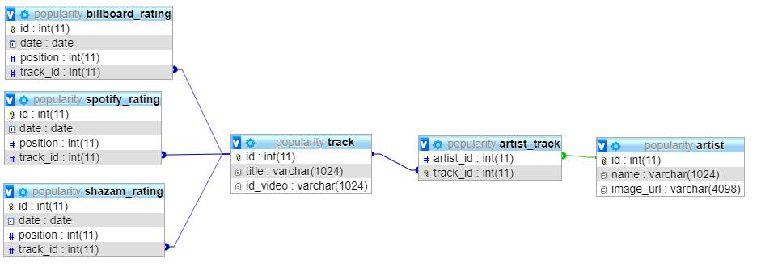
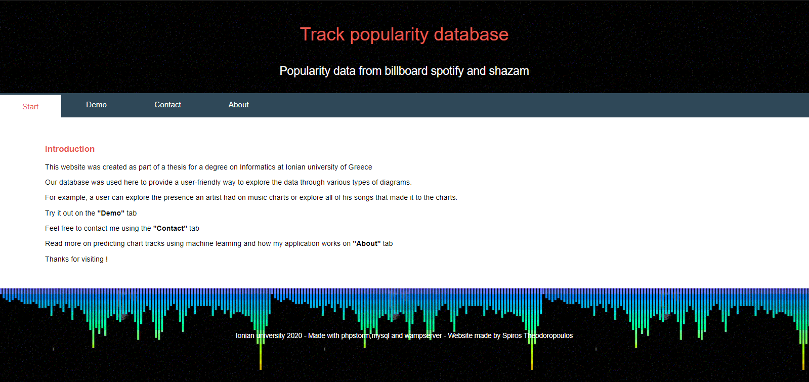

# Intro
Welcome, this page was developed as part of my thesis on "Informatics" deparment at Ionian university of Greece.
Below you can find an extended synopsis of my project. In the "Downloads" section, you may find the complete thesis document and the dataset that was created during my project.

Η παρούσα σελίδα δημιουργήθηκε ως μέρος της Διπλωματικής μου στο τμήμα πληροφορικής του Ιονίου πανεπιστημίου.
Παρακάτω μπορείτε να δείτε την περίληψη της εργασίας. Επειτα μπορείτε να κατεβάσετε το έγγραφο της πτυχιακής η το σετ δεδομένων.

### Extended synopsis
In this work, we attempt to solve the ”Hit Song Science” problem which aims to the prediction
of commercially successful songs before their distribution using their audio features
and characteristics. Predicting hit songs would have a huge impact on the development
of the music industry. Artists would be able to focus their efforts on more promising and
maybe even better songs and therefore increase their profits. Also further analyzing data
from popularity sources would lead to a better understanding of the history and trends of
music. Several works in the past have tried to address the issue.
Such works exist since 2005. 
Our first part of the work was based on a previous work that was published in 2016.
In the first part of this work, we constructed a database consisting of 2844 Music charts,
22600 hit songs, and 8329 artists, dating back to 1985 till today. Three popularity sources
were used to collect the data namely billboard, Spotify, and shazam. Also, an automated
data collection system was constructed. Attention was given to its error-proofing and
speed in an attempt to make a fully automated weekly update system for our database.
Later a website was made to present our work. The database was used on our website to
provide a user-friendly way to explore the data through various types of diagrams. For
example, a user can explore the presence an artist had on music charts or explore all of
his songs that made it to the charts. In the second part of this work, we constructed a
dataset in an attempt to solve the Hit Song Science problem. First using the database
we mentioned earlier we constructed a dataset with approximately 17430 hit songs. Later
we constructed a second dataset with approximately 17315 nonhit songs using a third
party dataset. We then combined the two datasets and extracted the audio features for
every track using the Spotify API. The column ”On chart” was also added to indicate if
the song is a hit or not. The final dataset contained approximately 34740 tracks and 17
features for each of the songs. To predict whether a song will be a hit or not we tested four
models on our dataset. Before testing the models we analyzed the dataset to understand
our data and check for missing or invalid values that may existed. The analysis of the
dataset showed a strong influence of the ”instrumentalness” and ”valence” features on the
”On chart” indicator. This led us to the assumption that the amount of vocals in the song
and the musical positiveness conveyed by the song may have a serious impact in defining
a song as hit or non-hit. Then we normalized our data using the min-max normalization
technique to make it more suitable for testing. The four models we used were:

* Support Vector Machine
* Neural Network
* Random Forest
* k-NN

The best model was Neural Network, which was able to predict hit songs with 78.71%
accuracy. The four models had the following accuracy results.

|  k-NN |  SVM  | Neural Networks | Random forest |
|:-----:|:-----:|:---------------:|:-------------:|
| 75.68 | 75.43 |      78.71      |     76.03     |

It should also be considered that according to the confusion matrix we constructed later,
Random Forest algorithm had fewer False Positive classifications than any other algorithm.
Finally, we believe that in the future more chart sources should be considered.
Also, further attention should be given to ”instrumentalness” and ”valence” audio features
which seemed to have a strong influence on the class.


### Περίληψη (Greek synopsis)

Στην παρούσα εργασία ασχοληθήκαμε με την δημιουργία ενός συστήματος συλλογής και
επαναδιάθεσης δεδομένων δημοτικότητας μουσικών κομματιών και στην συνέχεια με την πρό-
βλεψη των δημοφιλών κομματιών. Η εργασία χωρίστηκε σε δύο μέρη. Στο πρώτο μέρος
μελετήσαμε διάφορες πηγές λιστών δημοφιλών μουσικών κομματιών(λίστες επιτυχιών) ή ό-
πως συχνά αναφέρονται στα αγγλικά ”Music charts”. Καταλήξαμε σε τρεις πηγές από τις
οποίες αντλήσαμε δεδομένα τα οποία αποθηκεύτηκαν σε μια απλή βάση δεδομένων. Συγκε-
κριμένα αντλήθηκαν δεδομένα δημοτικότητας για 2.844 λίστες , 22.600 μουσικά κομμάτια και
8.329 καλλιτέχνες. Συνολικά η βάση περιείχε 337.981 εγγραφές και δεδομένα που χρονολο-
γούνται από το 1958 μέχρι σήμερα. Στην συνέχεια δημιουργήθηκε μια ιστοσελίδα η οποία
εκτός από διάφορες πληροφορίες για το σύστημα παρείχε και μερικές διαγραμματικές απεικο-
νίσεις των δεδομένων που αποθηκεύσαμε προηγουμένως στην βάση δεδομένων. Μέσω των
διαγραμματικών απεικονίσεων ο χρήστης μπορεί να πάρει μια πολύ καλή γεύση των δεδομένων
από μια διαφορετική οπτική σε σχέση με το πως παρουσιάζονται στις αρχικές πηγές. Στο δεύ-
τερο μέρος της εργασίας έγινε μια προσπάθεια να προβλέψουμε τα δεδομένα χρησιμοποιώντας
διάφορες τεχνικές μηχανικής μάθησης.Συγκεκριμένα αφού χρησιμοποιήσαμε την βάση δεδο-
μένων που κατασκευάσαμε στο πρώτο μέρος δημιουργήσαμε αρχικά ένα σετ δεδομένων που
περιείχε 17425 διάσημα κομμάτια μαζί με τα μουσικά χαρακτηριστικά που παράγει το spotify
για καθένα από αυτά. ΄Επειτα κατασκευάσαμε άλλο ένα σετ δεδομένων με 17315 μη-διάσημα
μουσικά κομμάτια, δηλαδή κομμάτια που δεν υπήρξαν ποτέ σε κάποια λίστα επιτυχιών, και έ-
πειτα προσθέσαμε και σε αυτά τα μουσικά χαρακτηριστικά που παράγει το spotify για καθένα
από αυτά.Ενώνοντας τα δύο σετ δεδομένων καταλήξαμε σε ένα σετ δεδομένων 34740 γραμμών
και 17 στηλών. ΄Υστερα αφού καθαρίσαμε, αναλύσαμε και κανονικοποιήσαμε το τελικό σετ
δεδομένων προχωρήσαμε στην πρόβλεψη των δεδομένων. Κατά την ανάλυση παρατηρήσαμε
μια σχέση της ποσότητας των φωνητικών σε ένα κομμάτι αλλά και της έντασης του με τον
δείκτη που δήλωνε αν το κομμάτι ήταν διάσημο ή όχι. ΄Επειτα κατά την πρόβλεψη των δεδομένων 
το μεγαλύτερο ποσοστό επιτυχίας ήταν 78.71%. Το αποτέλεσμα αυτό επετεύχθη με
χρήση της τεχνικής min - max για κανονικοποίηση, του αλγόριθμου Νευρωνικών δικτύων
για την δημιουργία του μοντέλου πρόβλεψης και της τεχνικής k-folds cross validation για την
αξιολόγηση του μοντέλου.

## Used code examples
Here you can check out some of the code we used:

Sql used to extract hit songs from our database:
```SQL
results = returnque("""SELECT track.title,artist.name,track.id_video FROM track
                        LEFT JOIN  artist_track ON track.id = artist_track.track_id 
                         LEFT JOIN artist ON artist_track.artist_id = artist.id""")
```

The following code in python was used to retrieve the spotify audio features from the spotify api and write them in a csv file:

```python
# creating new csv file for track features
with open('sfeatures.csv', 'w', newline='') as f_handle:
    writer = csv.writer(f_handle)
    # Add the header/column names
    header = ['duration_ms','energy','key', 'mode',
    'time_signature' ,'acousticness','danceability',
    'instrumentalness','liveness',
    'loudness','speechiness','valence','tempo']
    writer.writerow(header)
    # Iterate over `data`  and  write to the csv file
    for row in dtf["track_id"]:
        try:
            track= sp.audio_features(tracks=[row])
            features = [track[0]['duration_ms'],
            track[0]['energy'],
            track[0]['key'],track[0]['mode'],
            track[0]['time_signature'],
            track[0]['acousticness'],
            track[0]['danceability'],
            track[0]['instrumentalness'],
            track[0]['liveness'],track[0]['loudness'],
            track[0]['speechiness'],track[0]['valence'],
            track[0]['tempo']]
            writer.writerow(features)
        except:
            print("no features for"+str(row))
            features = [0,0,0,0,0,0,0,0,0,0,0,0,0]
            writer.writerow(features)
```
The following code was used to find the best k for the k-NN algorithm (using numpy,pandas and sklearn):

```python
temp = 0
tempi = 0
df = pd.DataFrame(columns = ["k",'score'])
for i in range (20,100): 
    model=KNeighborsClassifier(n_neighbors=i)
    dtf1=dtf.drop('On_chart',1)
    dtf2=dtf['On_chart']
    cv_r2_scores_rf=cross_val_score(model,dtf1,dtf2],cv=10)
    mean=np.mean(cv_r2_scores_rf)
    df.loc[i]=i
    df.loc[i,'score'] = mean
    if  mean > temp:
        temp = mean
        tempi = i 
print ("biggest success:",temp,", k =",tempi)
```
You can find see more code examples by visiting our repository through the "View on Github" button in the yellow box^

## Screenshots
DATABASE SCHEMA

Track popularity web page

Demo example


## Downloads

[Thesis](https://drive.google.com/file/d/1KvhkEQpyKf6sSu9xrEbjGlk5NSENUdIG/view?usp=sharing "Thesis") (Greek Version)

[Dataset](https://www.kaggle.com/multispiros/34740-hit-and-nonhit-songs-spotify-features "DATASET") on kaggle.com
